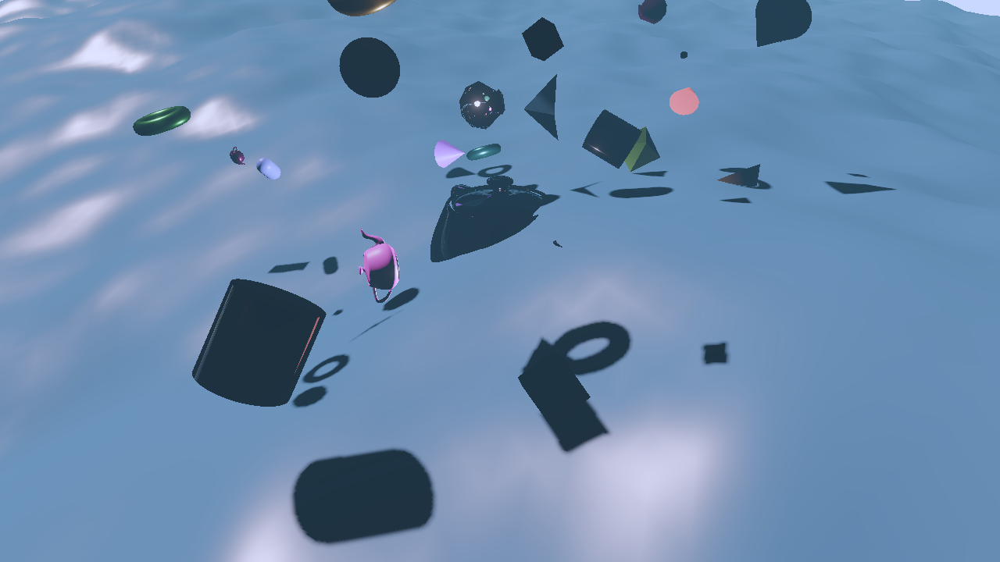

# DirectX 12 Toy Engine



Engine prototype for DX12 experimentation!


## Credit
- [3dgep.com](https://www.3dgep.com/learning-directx-12-1/) tutorials

## Dependencies
CMake LLVM toolchain with Ninja is preferred, you can also use MSVC. Check out `CMakePresets.json`.

## Building
```bash
cmake --preset windows-clang
cmake --build build --config Debug
```

## Agents
For agent contributions, see [AGENTS.md](AGENTS.md). This project is meant to be my learning of DirectX12, so I mostly use agents to write boilerplate, helping me write features while I learn the API by making more interesting features out of the building blocks that AI tools have provided. This project is also meant to be in feature-parity with my [OpenGL experimental engine](https://github.com/benpm/gl_playground).